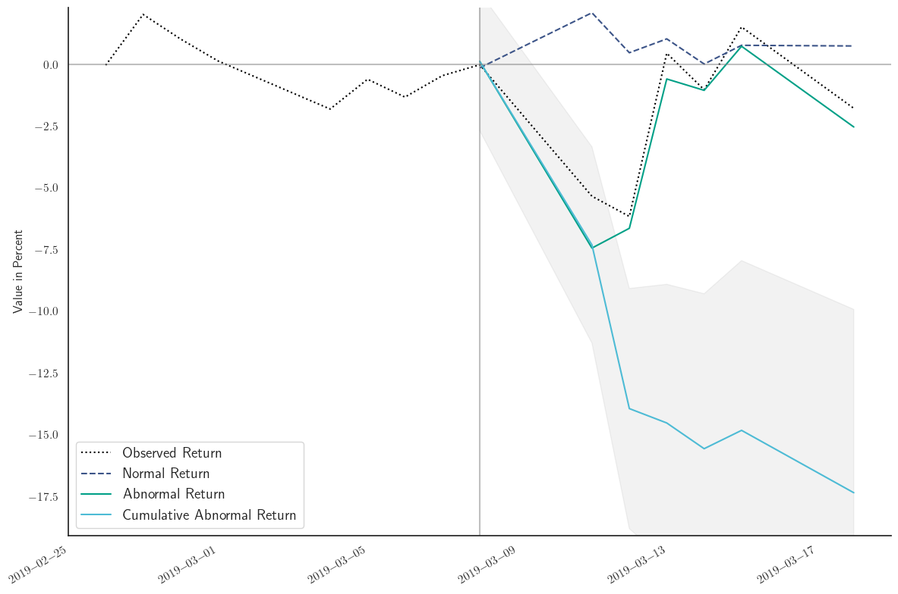

# EasyEventStudies

This package makes it easy to run event studies on financial assets. In contrast to other packages, it is easy to use, correct and allows for three different models of normal returns estimation. All calculations are based on the standard reference in the literature: *The Econometrics of Financial Markets; John Y. Campbell, Andrew W. Lo and Craig MacKinlay*
## Quick Start Guide

Install the package using `pip`:

```bash
pip install pip install EasyEventStudies==1.0
```

The `run_event_study` function runs a complete event study analysis for a financial asset and an event date. The package takes financial data from Yahoo Finance, so search for the ticker symbol of the asset you are interested on their website [here](https://finance.yahoo.com/). 
As an example, we will run an event study on Boeing Co. (ticker: BA) on 8th of March, 2019. At this time, the Boing 737 Max was involved in two crashes and the FAA was about to ground the fleet.

```python

results = run_event_study(
    ticker='BA',
    event_date='2019-03-08',
    estimation_window=[-250, 0],
    event_window=[0, 20],
    model_type="market_model"
)

plot_CAR_over_time(results)
```


The event study shows that the failure of the Boing 737 Max was associated with a drop in the stock price of about 17 Percent in the first 20 days after the event.


## More Detailed Documentation

1. The main function is `run_event_study`. It returns a pandas DataFrame with the results of the event study.

```python
def run_event_study(
    ticker: str, #Put in the ticker symbol from yahoo finance as a string, e.g. 'BA' for Boeing 
    event_date: str,#Put in the date of the event as a str, e.g. '2019-03-08' 
    estimation_window: Tuple[int, int], #Here you define which time is used to estimate the normal returns. The first number is the start of the window, the second number is the end of the window. If you want to use the previous year, put in [-250, -1].
    event_window: Tuple[int, int], #Here you define which time is used to calculate the cumulative abnormal returns. The first number is the start of the window, the second number is the end of the window. If you want to use the next 10 days, put in [0, 10].
    historical_days: int = 10, #Here you can define how many days before the event window should be included in the output. This allows you to plot the stock returns before the event.
    model_type: str = "market_model" #Here you can choose between three different models for the estimation of the normal returns. The three options are "market_model", "constant_model" and "three_factor_model".
):
```

Remember to specify the model you want to use to estimat normal returns. There are three types of models, which are common in the literature and which you can choose from:

1. Market Model (`"market_model"`): Estimates normal returns as a function of market returns
2. Constant Mean Return Model (`"constant_model"`): Assumes that normal returns are constant over the estimation window
3. Fama-French Three-Factor Model (`"three_factor_model"`): Estimates normal returns as a function of market returns, company size, and book-to-market ratio

### Model Formulas

#### 1. Market Model (`"market_model"`)
The market model assumes a linear relationship between the stock's returns and the market's returns:

$R_{it} = \alpha_i + \beta_i R_{mt} + \epsilon_{it}$

Where:
- $R_{it}$: Return of stock $i$ at time $t$
- $R_{mt}$: Return of the market index at time $t$
- $\alpha_i$: Intercept term for stock $i$
- $\beta_i$: Slope coefficient (beta) for stock $i$
- $\epsilon_{it}$: Error term

#### 2. Constant Mean Return Model (`"constant_model"`)
This model assumes that the expected return is constant over time:

$R_{it} = \mu_i + \epsilon_{it}$

Where:
- $\mu_i$: Average return of stock $i$ over the estimation window
- $\epsilon_{it}$: Error term

#### 3. Fama-French Three-Factor Model (`"three_factor_model"`)
The three-factor model includes additional factors for size and value:

$R_{it} = \alpha_i + \beta_i R_{mt} + s_i SMB_t + h_i HML_t + \epsilon_{it}$

Where:
- $R_{it}$: Return of stock $i$ at time $t$
- $R_{mt}$: Return of the market portfolio at time $t$
- $SMB_t$: Small Minus Big factor at time $t$ (size effect)
- $HML_t$: High Minus Low factor at time $t$ (value effect)
- $\alpha_i$: Intercept term for stock $i$
- $\beta_i$, $s_i$, $h_i$: Factor loadings for stock $i$
- $\epsilon_{it}$: Error term

Reference for this model:  Fama, E. F., & French, K. R. (1993). Common risk factors in the returns on stocks and bonds. Journal of Financial Economics, 33(1), 3-56.


2. The `plot_CAR_over_time` function plots the cumulative abnormal returns over time. It takes the results of the `run_event_study` function as an input and plots the cumulative abnormal returns over time.

```python
def plot_CAR_over_time(event_study_results,
                       days_before_event: int = 10, #This is the number of days before the event that should be included in the plot.
                       days_after_event: int = 10, #This is the number of days after the event that should be included in the plot.
                       ):
```

